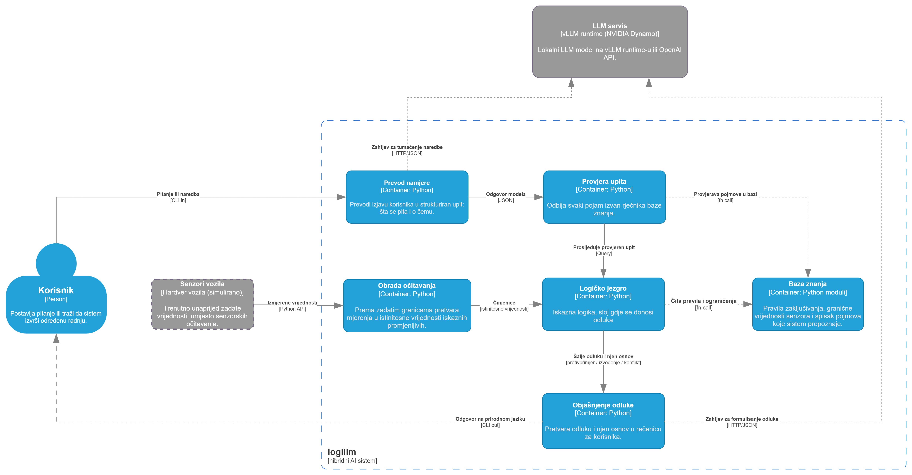

# logillm - hibridni AI sistem: logika + LLM

Projekat iz predmeta *Uvod u vještačku inteligenciju*, Prirodno-matematički fakultet, UNIBL.

Sistem za procjenu prijetnje u ADAS domenu (pomoć vozaču / korisniku). Odluku donosi **deterministički sloj iskazne logike**, a LLM služi samo za prevod između prirodnog jezika i formalnog zapisa.

## Arhitektura



Sistem prima dvije međusobno nezavisne vrste ulaza: očitavanja senzora i izjavu korisnika. Očitavanja opisuju trenutno stanje na putu, dok izjava određuje o čemu korisnik pita ili koju radnju zahtijeva.

**Baza znanja** objedinjuje pragove senzora, dozvoljene pojmove i formalna pravila ADAS domena. Tokom **grounding** koraka numerička očitavanja se, prema tim pragovima, pretvaraju u istinitosne vrijednosti logičkih činjenica. Time se podaci prevode u oblik koji formalni sloj može obraditi.

Izjava korisnika prolazi odvojenim putem. LLM je pretvara u strukturirani upit koji sadrži vrstu namjere i ciljni pojam iz baze znanja. Dobijeni upit se zatim validira: prihvataju se samo očekivana struktura, podržana vrsta namjere i unaprijed definisani pojmovi koje sistem može obraditi.

**Logičko jezgro** povezuje validirani upit sa činjenicama dobijenim iz senzora i pravilima iz baze znanja. Ako korisnik postavlja pitanje, provjerava se da li traženi zaključak slijedi iz tih činjenica i pravila. Ako zahtijeva radnju, provjerava se da li je ona u skladu sa trenutnim stanjem i pravilima.

Uz odluku se čuva i formalni osnov, kao što su relevantni koraci izvođenja, protivprimjer ili konfliktna pravila. LLM taj već utvrđeni rezultat samo pretvara u kratko objašnjenje razumljivo korisniku.

## Primjer

Ista rečenica vozača, dva različita očitavanja senzora. Prevod je u oba slučaja identičan; presudu mijenjaju senzori.

```text
vozač:   Treba li da kočim?
prevod:  {"mode": "claim", "target": "hitno_kocenje"}

  magla, vozilo ispred koči
    presuda:     MORA VAŽITI
    osnov:       senzori pokazuju: blizu, koci_ispred, magla
    osnov:       (magla -> smanjena_vidljivost)
    osnov:       (smanjena_vidljivost -> losi_uslovi)
    osnov:       ((blizu & koci_ispred) -> rizik_sudara)
    osnov:       ((rizik_sudara & losi_uslovi) -> nivo_kritican)
    osnov:       (nivo_kritican -> hitno_kocenje)
    objašnjenje: Usmeri se na kočenje jer je pred tobom vozilo u magli. Ovo je hitno potrebno da izbegneš sudar u ovim lošim uslovima.

  vedro, put slobodan
    presuda:     NE MORA VAŽITI
    osnov:       senzori pokazuju: (ništa posebno)
    osnov:       moguć je slučaj u kojem važi samo: (ništa)
    objašnjenje: Ne moraš kočiti jer senzori ne pokazuju ništa posebno. Nastavi vožnju bez ikakvih promena brzine.
```

Šta se iz ovoga vidi:

- **Zaključak je izveden u pet koraka.** Nijedno pravilo ne povezuje maglu i kočenje neposredno; taj put nastaje uzastopnom primjenom pravila iz baze znanja.
- **Objašnjenje se zasniva isključivo na navedenom osnovu.** LLM dobija odluku i pravila koja su do nje dovela, bez mogućnosti da ih dopuni ili izmijeni.
- **Presuda je deterministička, za razliku od objašnjenja.** Ponovno pokretanje istog scenarija daje istu odluku, dok se tekst objašnjenja može razlikovati.

## Preduslovi

### Logički sloj

- **Python 3.14** (razvijano na 3.14.0; verzija je zaključana u `.python-version`)
- **[uv](https://docs.astral.sh/uv/) 0.9+** — upravljanje okruženjem i zavisnostima

### LLM sloj

- računar ili server sa NVIDIA GPU
- Docker + NVIDIA Container Toolkit
- pristup HuggingFace-u radi preuzimanja LLM modela

## Instalacija

```bash
git clone https://github.com/neuralmaticv/logillm.git
cd logillm
uv sync
```

Komanda `uv sync` koristi verziju Pythona navedenu u `.python-version`, instalira zavisnosti i pravi virtuelno okruženje u direktorijumu `.venv` unutar projekta. Okruženje nije potrebno ručno aktivirati: naredbe projekta pokreću se sa `uv run`.

### Konfiguracija

Za pokretanje cijelog hibridnog sistema prvo kopirajte primjer konfiguracije:

```bash
cp .env.example .env
```

Podešavanja se čitaju iz `.env`. Promjenljive okruženja imaju prednost nad nad tim vrijednostima tako da se pojedinačne vrijednosti mogu privremeno promijeniti bez izmjene fajla.

```bash
# LLM provider: local | openai
LOGILLM_LLM_PROVIDER=local

# lokalni vLLM server
LOGILLM_LOCAL_URL=http://<ip-servera>:8111/v1
LOGILLM_LOCAL_MODEL=Qwen/Qwen3.5-9B
LOGILLM_LOCAL_THINKING=0

# OpenAI
LOGILLM_OPENAI_URL=https://api.openai.com/v1
LOGILLM_OPENAI_MODEL=<naziv-modela>
OPENAI_API_KEY=<kljuc>
```

Za lokalni LLM potrebno je podesiti adresu vLLM servera i naziv modela. Za OpenAI potrebno je navesti ID/naziv modela i `OPENAI_API_KEY`.

`LOGILLM_LOCAL_THINKING=0` isključuje *thinking* režim LLM-a.

## Pokretanje

```bash
uv run demo_logic.py    # logičko jezgro: posljedica, protivprimjer, zadovoljivost
uv run demo_llm.py      # cijeli pipeline, zahtijeva LLM server
```

`demo_llm.py` prihvata provajdera kao argument, inače uzima `LOGILLM_LLM_PROVIDER` iz `.env`:

```bash
uv run demo_llm.py local
uv run demo_llm.py openai
```

Provjera da je LLM server dostupan i pod kojim imenom očekuje model:

```bash
curl http://<ip-servera>:8111/v1/models
```

Provjera koda:

```bash
uv run ruff check .
uv run ruff format .
```

## LLM server

U ovoj fazi koristi se lokalni LLM model `Qwen/Qwen3.5-9B` ([HF repo](https://huggingface.co/Qwen/Qwen3.5-9B)), serviran preko `vLLM` instance sa OpenAI-kompatibilnim endpointom. Izbor konkretnog modela nije presudan, jer LLM ne donosi formalnu odluku, već prevodi ulaz i objašnjava rezultat logičkog modula.

Komanda korišćena za pokretanje servera:
```bash
docker run -d --rm --name vllm-test --gpus all --ipc host --network host \
  -e HF_HOME=/hf-cache-path/ \
  -v /hf-cache-path/:/hf-cache-path/ \
  --group-add <gid-for-gpu> \
  --entrypoint vllm \
  nvcr.io/nvidia/ai-dynamo/vllm-runtime:1.4.2 \
  serve Qwen/Qwen3.5-9B \
    --host 0.0.0.0 --port 8111 \
    --gpu-memory-utilization 0.50 \
    --max-model-len 16384 \
    --max-num-seqs 32
```

| Opcija | Značenje |
|---|---|
| `--ipc host` | dijeljena memorija hosta jer je Dockerova memorija premaala za PyTorch | 
| `-v ...` | keš modela ostaje na hostu, pa se ne preuzima ponovo |
| `--gpu-memory-utilization 0.50` | zauzima 50% ukupne GPU memorije |
| `--max-model-len 16384` | najveća dužina konteksta; po potrebi smanjiti |

## Reference

- Pan, Albalak, Wang i Wang. **Logic-LM: Empowering Large Language Models with Symbolic Solvers for Faithful Logical Reasoning**. [arXiv:2305.12295](https://arxiv.org/abs/2305.12295), 2023.
- Yang i Tam. **Exploring an LM to Generate Prolog Predicates from Mathematics Questions**. [arXiv:2309.03667](https://arxiv.org/abs/2309.03667), 2023.
- Yang, Chen i Tam. **Arithmetic Reasoning with LLM: Prolog Generation & Permutation**. [arXiv:2405.17893](https://arxiv.org/abs/2405.17893), 2024.
- Han, Chen, Gupta i Altintas. **Scene-Aware Conversational ADAS with Generative AI for Real-Time Driver Assistance**. [arXiv:2507.10500](https://arxiv.org/abs/2507.10500), 2025.
